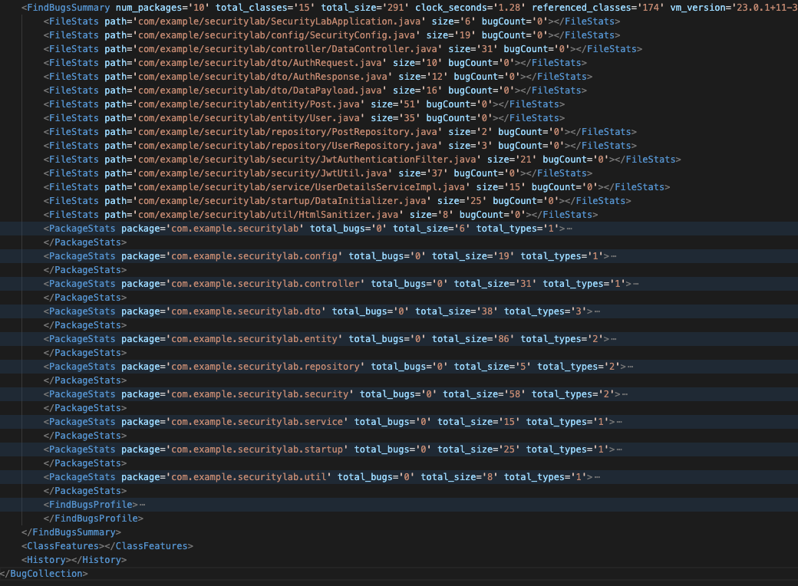
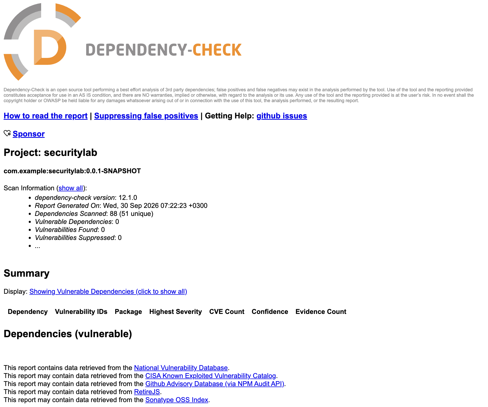

# Лабораторная работа №1 по информационной безопасности

## О проекте

- Spring Boot API
- JWT-аутентификация
- PostgreSQL
- защищённый набор эндпоинтов для работы с данными и профилем
- CI/CD с SAST и SCA

## API

### 1. Авторизация

- `POST /auth/login`
- вход: `username`, `password`
- ответ: JWT token + expiration

```bash
curl -X POST http://localhost:8080/auth/login \
  -H "Content-Type: application/json" \
  -d '{
    "username": "admin",
    "password": "StrongAdminPassword123!"
  }'
```

### 2. Получение данных

- `GET /api/data`
- требует JWT
- возвращает список постов

```bash
curl -X GET http://localhost:8080/api/data \
  -H "Authorization: Bearer <JWT_TOKEN>"
```

### 3. Профиль текущего пользователя

- `GET /api/profile`
- требует JWT
- возвращает username + message

```bash
curl -X GET http://localhost:8080/api/profile \
  -H "Authorization: Bearer <JWT_TOKEN>"
```

## Меры защиты

### Аутентификация и авторизация

- `SecurityConfig`
- `permitAll()` только для `/auth/login` и `/error`
- все остальные маршруты: `authenticated()`
- `BCryptPasswordEncoder`
- JWT filter: проверка `Authorization: Bearer ...`
- `JwtAuthenticationFilter`: в каждом запросе
  - извлекает токен
  - валидирует подпись и срок жизни
  - загружает пользователя по username
  - кладёт authentication в `SecurityContextHolder`
- `JwtUtil`
  - обязательная проверка `jwt.secret`
  - минимальная длина секрета: 32 символа
  - `HS256`
  - expiration в ms

### Защита от SQL Injection

- основная работа с БД через Spring Data JPA / Hibernate
- репозитории без raw SQL
- все запросы идут через параметризованные JPA-методы
- `UserRepository.findByUsername(...)`
- `PostRepository.findAllByOrderByCreatedAtDesc()`
- нет конкатенации пользовательского ввода в SQL строку

### Защита от XSS

- `HtmlSanitizer`
- `StringEscapeUtils.escapeHtml4(...)`
- HTML-экранирование перед возвратом данных в ответ
- применено к username, title, content, author

## Скриншоты отчётов




